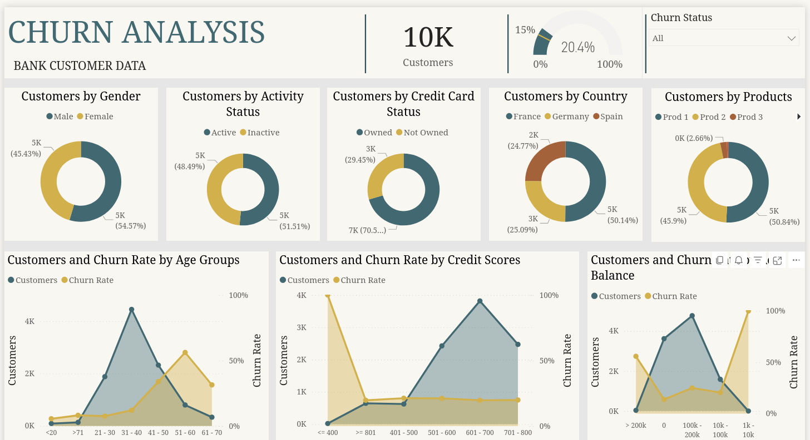

# customer-churn-analysis-Power-BI

This project analyzes customer churn for a bank to help understand which customers are likely to leave and the factors driving churn.

## Project Overview
- **Objective:** Understand customer behavior and churn patterns to support retention strategies.
- **Tools Used:** Power BI
- **Key Insights:**
  - Distribution of customers by gender, activity status, and credit card status.
  - Insights on the types of products held by customers.
  - Churn trends across different age groups.
  - How credit score correlates with customer retention and churn.
  - Relationship between account balance and likelihood to churn.
  - Identification of high-risk customer segments for targeted intervention.

## Visualizations
- Customer by Gender
- Customer by Activity Status
- Customer by Credit Card Status
- Customer by Products
- Customers and Churn Rate by Age Groups
- Customers and Churn Rate by Credit Score
- Customers and Churn Rate by Age Group
- Customers and Churn Rate by Account Balance

